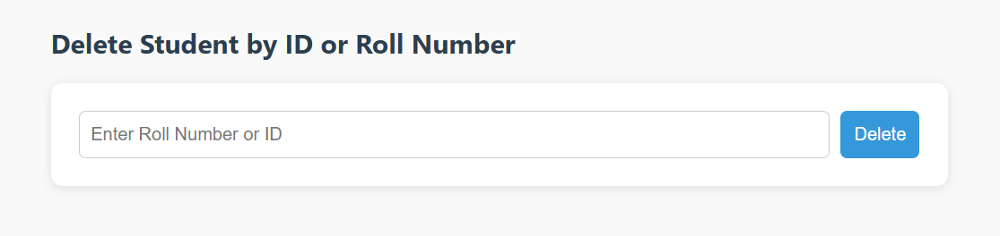

# Student Registration Web Application

## Description
A full-stack Java Spring Boot application to register, view, and delete student records.

## Features
- Register new students (Name, Roll Number, College, Course)
- View list of all students
- Delete students by ID or Roll Number

## Technology Stack
- Backend: Spring Boot, Java, Spring Data JPA, Posgresql
- Frontend: HTML, CSS, JavaScript
- REST API
- CORS enabled for frontend communication

## Getting Started
git clone https://github.com/yourusername/student-registration-app.git

## 🔍 UI Screenshots

### 📝 Registration Form  


### 📋 Student List  


### ❌ Delete Student  



### 1. Clone the repo
```bash
